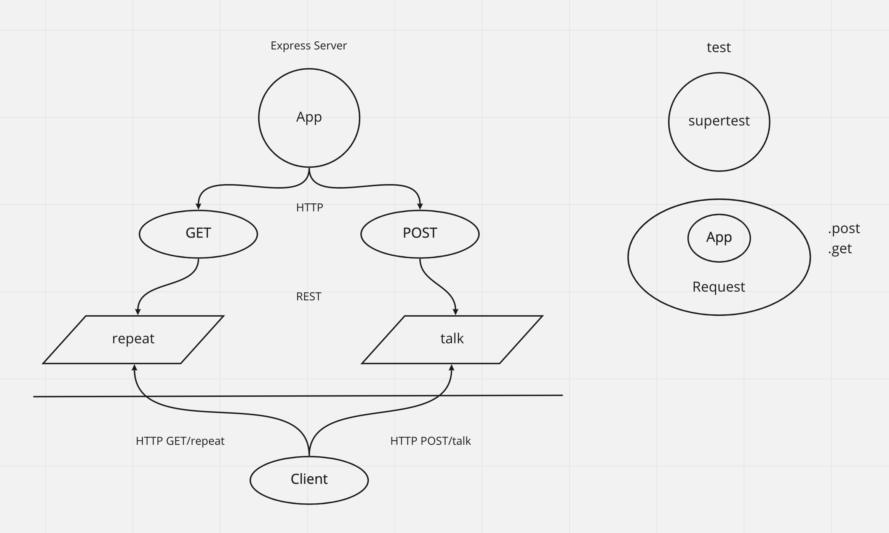

# Express Server

Created by Ryan Emmans

## Installation

None currently.

## Summary of Problem Domain

Create and deploy a web server using CI and CD and get used to the general process of building and deploying servers.

## Links to application deployment

- [dev Branch](https://ryanemmans-server-deploy-dev.herokuapp.com/)
- [main Branch](https://ryanemmans-server-deploy-prod.herokuapp.com/)
- [GitHub Actions](https://github.com/ryanemmans/server-deployment-practice/actions)
- [Pull Request](https://github.com/ryanemmans/server-deployment-practice/pull/1)

## Include embedded UML

## Routes

- HTTP GET
  - Path: /repeat
    - responds with the last string used in post route `/talk`.

- HTTP POST
  - Path: /talk
    - Accepts a string.
    - responds with a string in all caps.

## Notes

- This was my first exposure to creating and running my own tests using jest and superagent.
- We created route functions and middleware which were then exported and required into our app.js.
- We also updated our scripts on our package.json to enable jest and proper deployment through Heroku.
